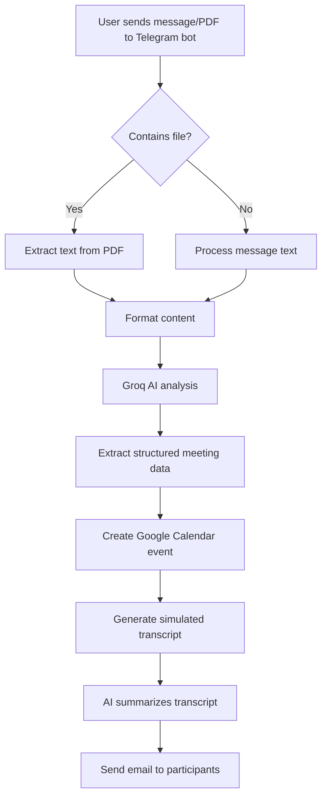

# 📱➡️📅 Telegram to Calendar AI Workflow

[](https://n8n.io/)
[](https://groq.com/)
[](https://calendar.google.com/)
[](https://gmail.com/)

An intelligent meeting planner that integrates Telegram with your calendar system using automation workflows. This solution leverages the power of AI to transform messages and documents into structured calendar events with minimal human effort.

## 🔍 Overview

This workflow automates the meeting scheduling process by allowing users to send messages or documents through Telegram. The system intelligently extracts relevant information, schedules the meeting, and communicates the details to all participants.


---

## 🧠 Key Features

- **Multi-Source Input Handling**
  - 💬 Process natural language meeting requests via Telegram messages
  - 📄 Extract and analyze content from uploaded PDF documents
  - 📊 Handle various information formats and structures

- **AI-Powered Processing**
  - 🤖 Use Groq's LLM to interpret unstructured meeting requests
  - 📋 Automatically extract key details (time, participants, purpose)
  - 🔄 Convert vague requests into structured meeting parameters

- **Comprehensive Meeting Management**
  - 📆 Create detailed Google Calendar events with proper metadata
  - 👥 Intelligently identify and add all participants
  - 📝 Generate detailed meeting agendas and discussion points

- **Advanced Communication**
  - ✉️ Send professional email notifications with all meeting details
  - 📑 Include AI-generated meeting summaries and action items
  - 📊 Provide simulated transcripts to give context to the meeting

- **Flexible System Integration**
  - 🔄 Seamlessly connect multiple services (Telegram, Google, Groq)
  - 🌐 Deploy locally or on cloud infrastructure
  - 🔌 Extensible architecture to add new integrations

---

## 🚀 How It Works



### Detailed Workflow

1. **Input Reception**
   - User sends a message/PDF to the Telegram bot
   - System identifies the content type and format

2. **Content Extraction**
   - For PDF files: Extracts and processes text content
   - For messages: Analyzes natural language to identify meeting intent

3. **AI Processing**
   - Groq AI interprets the content to extract:
     - Date and time parameters (with intelligent defaults)
     - Meeting title and purpose
     - Required participants
     - Location information (physical or virtual)
     - Meeting duration

4. **Calendar Integration**
   - Creates properly formatted Google Calendar event
   - Sets appropriate meeting parameters
   - Adds all identified participants

5. **Transcript Generation**
   - Uses AI to simulate a potential meeting transcript
   - Generates realistic dialogue based on meeting purpose

6. **Summarization**
   - AI creates a concise meeting summary
   - Highlights key discussion points and action items

7. **Communication**
   - Composes detailed email with all meeting information
   - Sends notifications to all participants via Gmail
   - Includes calendar link and summary information

---

## 🛠️ Requirements

### Required Services

- **n8n**: Workflow automation platform (v0.214.0+)
- **Telegram Bot**: For user interaction
- **Groq API**: For AI processing capabilities
- **Google Workspace**: For Calendar and Gmail integration

### API Credentials

| Service | Credential Type | Required Scopes |
|---------|----------------|----------------|
| Telegram | Bot API Token | Messages, Files |
| Groq | API Key | Chat Completions |
| Google | OAuth 2.0 | Calendar (read/write), Gmail (send) |

### System Requirements

- **Memory**: 2GB+ RAM
- **Storage**: 1GB+ free space
- **Processor**: Any modern CPU
- **Network**: Stable internet connection
- **OS**: Any OS supporting Docker or Node.js

---

## 🧩 Workflow Components

### Node Configuration

| Node | Configuration | Notes |
|------|--------------|-------|
| **Telegram Trigger** | Webhook mode with poll updates | Configure to receive messages and documents |
| **Extract from File** | Binary data handling | Set to extract text from PDFs |
| **Groq Chat Model** | Temperature: 0.7, Model: Mixtral | Configure system prompt for meeting extraction |
| **Google Calendar** | Write mode | Set timezone handling to user preference |
| **Gmail** | HTML formatting enabled | Configure sender display name |

### Key Code Transformations

```javascript
// Example code for parsing AI output into calendar fields
function parseAIOutput(output) {
  const result = {
    startDate: null,
    endDate: null,
    title: "",
    description: "",
    participants: []
  };
  
  // Parsing logic
  // ...
  
  return result;
}
```

---

## 📋 Setup Instructions

### Initial Setup

1. **Install n8n**
   ```bash
   # Using Docker
   docker run -it --rm \
     --name n8n \
     -p 5678:5678 \
     -v ~/.n8n:/home/node/.n8n \
     n8nio/n8n
   ```

2. **Create API Credentials**
   - Set up a [Telegram Bot](https://core.telegram.org/bots#how-do-i-create-a-bot) via BotFather
   - Obtain a [Groq API key](https://console.groq.com/)
   - Configure [Google OAuth 2.0](https://developers.google.com/identity/protocols/oauth2)

3. **Import Workflow**
   - Access your n8n instance at `http://localhost:5678`
   - Navigate to Workflows → Import From File
   - Upload the workflow JSON file

### Configuration

1. **Configure Telegram Webhook**
   ```bash
   curl -F "url=https://your-n8n-instance.com/webhook/telegram" \
        -F "certificate=@cert.pem" \
        https://api.telegram.org/bot<YOUR_BOT_TOKEN>/setWebhook
   ```

2. **Set up Credentials in n8n**
   - Navigate to Settings → Credentials
   - Add credentials for each required service
   - Test connections to ensure functionality

3. **Customize System Prompts**
   - Modify the Groq AI system prompt to match your organization's needs
   - Adjust email templates and calendar event formats

4. **Activate Workflow**
   - Toggle the "Active" switch in the n8n workflow editor
   - Send a test message to verify the workflow is functioning

---

## 🔧 Troubleshooting

### Common Issues

| Problem | Solution |
|---------|----------|
| Telegram webhook not receiving messages | Check URL configuration and firewall settings |
| PDF extraction failing | Verify PDF is not password protected or corrupt |
| Calendar events not being created | Confirm Google OAuth scopes include calendar write permissions |
| Emails not being sent | Check Gmail quota and authentication status |

### Debug Tips

- Enable n8n execution logs for detailed troubleshooting
- Test each node individually using n8n's "Run" function
- Verify API key validity for all external services

---

## 🚀 Use Cases

- **Executive Assistant**: Schedule meetings based on email threads or documents
- **Project Management**: Convert meeting notes into scheduled follow-ups
- **Customer Support**: Schedule client meetings from support conversations
- **HR Onboarding**: Set up orientation meetings from candidate documents
- **Education**: Schedule student consultations based on submitted assignments

---
